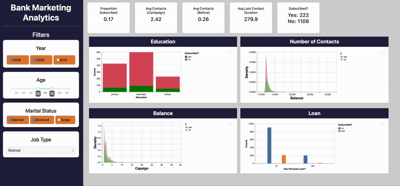

# 📊 Bank Marketing Dashboard

**Authors: Hrayr Muradyan, Joseph Lim, Merari Santana–Carbajal, Mason Zhang**

## Welcome!

Our **Bank Marketing Dashboard** helps financial institutions optimize their telemarketing strategies for term deposit subscriptions. By analyzing **client demographics, financial status, and previous marketing interactions**, we seek to identify key factors influencing customer decisions.

The dashboard will provide **interactive visualizations** that enable marketing managers to explore customer characteristics and improve targeting strategies. Our goal is to help financial institutions **increase conversion rates, reduce unnecessary outreach, and enhance overall campaign efficiency through data-driven insights.**

## 🎬 Demo

Give the demo **a try yourself** by clicking [this link](https://dsci-532-2025-12-bank-marketing.onrender.com)!

Please take a look at the **GIF below** for a quick demo of our dashboard!



## 💾 **Installation Instructions**

**These steps will guide you through setting up and running the Student Academic Performance Dashboard.**

1.  Clone the Repository to get a local copy of the project:

    ```         
    git clone https://github.com/UBC-MDS/DSCI-532_2025_12_bank-marketing.git
    ```

2.  In your Terminal, move to the root directory of the project:

    ```         
    cd path-to-root-directory-of-project
    ```

3.  Create the Conda environment from the environment.yml file:

    ```         
    conda env create -f environment.yaml
    ```

    and activate it:

    ```         
    conda activate dsci532
    ```

4.  In Terminal, run the app:

    ```         
    python src/app.py
    ```

5.  After running the app, a URL (something like [`http://127.0.0.1:5000/`](http://127.0.0.1:5000/)) will be displayed in your terminal. Copy and paste the URL into your web browser to access the dashboard!

## 🛠️ Support

If you encounter a problem or have suggestions for improvement: - Open an **issue** in this [GitHub repository](https://github.com/UBC-MDS/DSCI-532_2025_12_bank-marketing/issues) We’ll review it **right away!**

## 🤝 Get Involved!

Interested in contributing? **We’d love to have you!**

-   Check out the [**Contributing Guidelines**](CONTRIBUTING.md)
-   Learn how to **install dependencies** and run the app locally
-   Please follow our [**Code of Conduct**](CODE_OF_CONDUCT.md) in all interactions

💡 **Let's build better marketing strategies with data-driven insights!**
